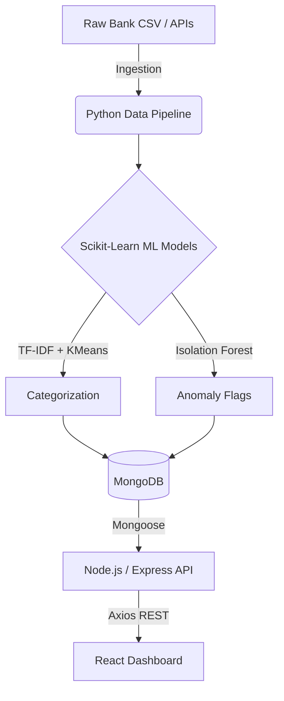

# WealthSense-ML

An AI-powered personal finance dashboard that ingests transaction data, utilizes Scikit-Learn for intelligent clustering and anomaly detection, and visualizes the insights through a modern React dashboard.

## System Architecture

## Setup Instructions

| Component | Commands to Run |	Port |
| :--- | :--- | :--- |
| **Database** | mongod (Ensure local MongoDB is running) |	27017 |
| **ML Pipeline** |	cd ml_pipeline && pip install -r requirements.txt && python train_and_process.py |	N/A |
| **Backend** |	cd backend && npm install && npm start	| 5000 |
| **Frontend** | cd frontend && npm install && npm run dev |	5173 |

## Model Performance & Rationale

| Task | Algorithm | Rationale for Indian Context |
| :--- | :--- | :--- |
| **Text Embedding** | TF-IDF |	Handles high cardinality of custom merchant strings (e.g., specific UPI handles) better than standard categorical encoding. |
| **CategorizationPipeline** |	K-Means Clustering | Groups mathematically similar embedded strings and amounts into logical spending buckets without requiring predefined labels. |
| **Fraud Detection** |	Isolation Forest | Excels at isolating rare, high-magnitude transactions (e.g., sudden ₹95,000 transfer) by constructing random decision trees. |

## Recommended Dataset
Download the Bank Transaction Data on Kaggle to train and test the ML pipeline before integrating live data. (This is the one I used)

https://www.kaggle.com/datasets/apoorvwatsky/bank-transaction-data