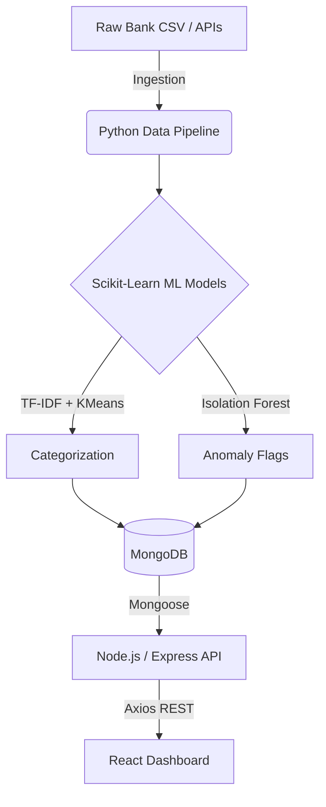

# WealthSense-ML

An AI-powered personal finance dashboard that ingests transaction data, utilizes Scikit-Learn for intelligent clustering and anomaly detection, and visualizes the insights through a modern React dashboard.

## System Architecture


## Setup Instructions
### Important:
- Create 2 diff terminals for backend and frontend
- ML_Pipeline is to be run on venv (.\venv\Scripts\Activate.ps1)

| Component | Commands to Run |	Port |
| :--- | :--- | :--- |
| **Database** | mongod (Ensure local MongoDB is running) |	27017 |
| **ML Pipeline** |	1. ```cd ml_pipeline ``` <br>2.  ``` .\venv\Scripts\Activate.ps1 ``` <br>3.  ```pip install -r requirements.txt``` <br>4.  ```python train_and_process.py ``` <br> 5. ```uvicorn api:app --reload --port 8000```|	N/A |
| **Backend** |	1. ```cd backend``` <br> 2. ```npm install``` <br> 3. ``` npm start```	| 5000 |
| **Frontend** | 1. ```cd frontend``` <br> 2.```npm install```<br>3. ```npm run dev``` |	5173 |

## Model Performance & Rationale

| Task | Algorithm | Rationale for Indian Context |
| :--- | :--- | :--- |
| **Text Embedding** | TF-IDF |	Handles high cardinality of custom merchant strings (e.g., specific UPI handles) better than standard categorical encoding. |
| **CategorizationPipeline** |	K-Means Clustering | Groups mathematically similar embedded strings and amounts into logical spending buckets without requiring predefined labels. |
| **Fraud Detection** |	Isolation Forest | Excels at isolating rare, high-magnitude transactions (e.g., sudden ₹95,000 transfer) by constructing random decision trees. |

## Recommended Dataset
Download the Bank Transaction Data on Kaggle to train and test the ML pipeline before integrating live data. (This is the one I used)

https://www.kaggle.com/datasets/apoorvwatsky/bank-transaction-data

## For post setup uses open 3 Terminals:

1. Terminal 1
```bash
cd ml_pipeline
uvicorn api:app --reload --port 8000
```

2. Terminal 2
```bash
cd backend
npm start
```

3. Terminal 3
```bash
cd frontend
npm run dev
```